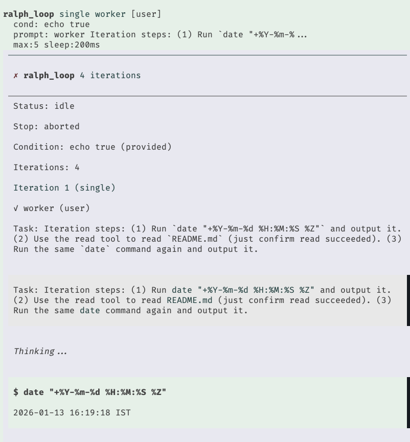

# pi-extensions

Minimal reference extensions for [`pi-coding-agent`](https://www.npmjs.com/package/@mariozechner/pi-coding-agent).

## Quick Setup

Install the package:
```bash
pi install npm:pi-hooks@latest
pi config  # enable/disable extensions
```

Dependencies are installed automatically during `pi install`.

To pull updates later:
```bash
pi update git:github.com/prateekmedia/pi-hooks
```

## Included Extensions

### `checkpoint/`

Git-based checkpoint system for restoring code state when forking conversations.

- Captures repo state at the start of every turn (tracked, staged, and untracked files)
- Stores checkpoints as Git refs for persistence across sessions
- Offers restore options: files + conversation, conversation only, or files only
- Automatically saves current state before restoring past snapshots


### `lsp/`

Language Server Protocol integration (hook + tool).

The package exports two extensions via `package.json`:
- `lsp-hook.ts` - Auto-diagnostics (default at agent end)
- `lsp-tool.ts` - On-demand LSP queries

**Hook** (auto-diagnostics):
- Default: runs diagnostics once at agent end for touched files
- Optional: run after each `write`/`edit`
- Configure via `/lsp` to switch to per-edit or disabled
- Supports web, Flutter, and common backend stacks
- Manages LSP server lifecycles per project root

**Tool** (on-demand queries):
- Definitions, references, hover, symbols, diagnostics, signatures
- Query by symbol name or line/column position


### `permission/`

Layered permission control with four permission levels:

| Level   | Description           | What's allowed                                      |
|---------|-----------------------|-----------------------------------------------------|
| Minimal | Read-only mode        | Only read commands (ls, cat, git status, etc.)      |
| Low     | File edits            | + write/edit files                                  |
| Medium  | Dev commands          | + npm, git, make, cargo, etc.                       |
| High    | Full access           | Everything (dangerous commands still prompt)        |

On first run you pick a level; it's saved globally. Use `/permission` to change levels and `/permission-mode` to switch between ask/block prompts.


### `ralph-loop/`

Looped subagent execution via the `ralph_loop` tool.



- Runs single or chain subagent tasks until a condition returns false
- Takes a prompt and exit condition (exit condition optional)
- Can supply max iterations and minimum delay between each
- Optionally supply model and thinking
- Supports `conditionCommand`, `maxIterations`, and `sleepMs` controls
- Interactive steering/follow-up + pause/resume/stop commands in UI mode
- Defaults to the `worker` agent and the last user prompt when omitted
- No npm install required

Example prompt: "Use ralph loop to check the current time five times, sleeping 1s between iterations."

### `repeat/`

Repeat past tool calls (bash/edit/write) from the current branch.

- `/repeat` shows a picker of recent bash/edit/write tool calls with type-to-search filtering
- Bash entries load as `!command` in the editor for tweak + run
- Write entries open a temp editor (if `$EDITOR` is set) and apply only when you save
- Edit entries can repeat the edit (may fail) or open `$EDITOR` at the first changed line; repeat uses a temp editor and applies on save

### `token-rate/`

Shows the average output tokens per second (TPS) in the footer status line.


## Usage

1. Install the package and enable extensions:
   ```bash
   pi install npm:pi-hooks@latest
   pi config
   ```

2. See inline comments in each extension for configuration options.

## Testing

```bash
cd lsp && npm install
cd ../permission && npm install
cd ../checkpoint && npm test
cd ../lsp && npm run test:all
cd ../permission && npm test
```

## License

MIT
