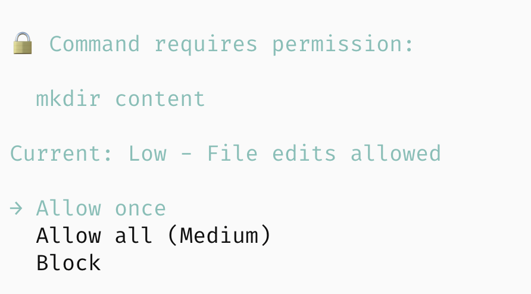

# pi-hooks

Minimal reference hooks for [`pi-coding-agent`](https://www.npmjs.com/package/@mariozechner/pi-coding-agent).

## Included hooks

### `checkpoint/checkpoint.ts`
- Captures your repo state at the start of every turn (tracked, staged, and untracked files)
- Stores checkpoints as Git refs so you can restore code when branching conversations
- Automatically saves the current worktree before restoring past snapshots


### `lsp/lsp-hook.ts`
- Runs Language Server Protocol (LSP) diagnostics after each `write`/`edit`
- Supports web, Flutter, and common backend stacks via the servers configured in the hook
- Manages LSP server lifecycles per project root for responsive feedback


### `autonomy/autonomy.ts`
Layered permission control with four autonomy levels:

| Level  | Description           | What's allowed                                      |
|--------|-----------------------|-----------------------------------------------------|
| Off    | Read-only mode        | Only read commands (ls, cat, git status, etc.)      |
| Low    | File edits            | + write/edit files within project                   |
| Medium | Dev commands          | + npm, git, make, cargo, etc.                       |
| High   | Full access           | Everything (dangerous commands still prompt)        |

On first run you pick a level; it's saved per-project. You can escalate mid-session when needed.



## Usage
1. Install dependencies inside each hook directory (`npm install`).
2. **Project-scoped setup (`.pi/hooks`)**
   ```bash
   # from the project root
   mkdir -p .pi/hooks
   cp checkpoint/checkpoint.ts .pi/hooks/checkpoint.ts
   cp lsp/lsp-hook.ts .pi/hooks/lsp-hook.ts
   ```
   pi automatically loads hooks under `.pi/hooks` when you run it inside this repository.
3. **Global settings example** – reference the hook files directly from anywhere:
   `~/.pi/agent/settings.json`
   ```json
   {
     "hooks": [
       "/absolute/path/to/pi-hooks/checkpoint/checkpoint.ts",
       "/absolute/path/to/pi-hooks/lsp/lsp-hook.ts",
       "/absolute/path/to/pi-hooks/autonomy/autonomy.ts"
     ]
   }
   ```
4. Consult the inline comments in each hook for configuration tweaks or additional server support.

## License

MIT
